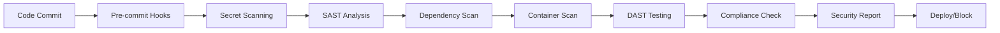

# CSB DevSecOps Test Repository - Enhanced Edition

[](https://opensource.org/licenses/MIT)
[](https://github.com/csb/devsecops-test/security)
[](https://github.com/csb/devsecops-test)
[](https://codespaces.new/csb/devsecops-test)

> ⚠️ **WARNING**: This repository contains **intentional security vulnerabilities** for testing purposes. **DO NOT** deploy to production environments.

## 🎯 Purpose

This repository serves as a comprehensive testing ground for CSB's DevSecOps pipeline, security tools, and CI/CD processes. It contains sample applications across our entire technology stack with intentional security vulnerabilities to validate our security scanning capabilities, including **MuleSoft DataWeave transformations** and **Drupal security testing**.

## 🏗️ Complete Technology Stack

```
┌─────────────────────────────────────────────────────────────────┐
│                    CSB Enhanced Technology Stack                │
├─────────────────────────────────────────────────────────────────┤
│  Frontend: React + Angular (TypeScript)                        │
│  Backend: Python + Java + C# + Node.js + PHP + MuleSoft       │
│  Databases: PostgreSQL + MySQL + Oracle                        │
│  Security: 8+ scanning tools with custom rules                 │
│  Platform: GitHub Codespaces + Local Development               │
└─────────────────────────────────────────────────────────────────┘
```

## 📁 Enhanced Repository Structure

```
csb-devsecops-test/
├── 🖥️  frontend/                    # Frontend Applications
│   ├── react-app/                   # React + TypeScript (security testing)
│   └── angular-app/                 # Angular + TypeScript (XSS vulnerabilities)
├── ⚙️  backend/                     # Backend Applications  
│   ├── python-django/               # Django Web Framework (SQL injection)
│   ├── python-flask/                # Flask API (command injection)
│   ├── java-springboot/             # Spring Boot API (auth bypass)
│   ├── java-mulesoft/               # MuleSoft + DataWeave (banking vulns)
│   ├── csharp-webapi/               # .NET Core Web API (crypto issues)
│   ├── csharp-etl/                  # C# ETL Tools (path traversal)
│   ├── node-express/                # Node.js Express API (prototype pollution)
│   └── php-drupal/                  # Drupal Application (access control)
├── 🗄️  databases/                   # Database Configurations
│   ├── postgresql/                  # PostgreSQL schemas & seed data
│   ├── mysql/                       # MySQL schemas & Drupal data
│   └── oracle/                      # Oracle procedures & banking schemas
├── 🔒 security/                     # Security Configurations & Tools
│   ├── dashboard/                   # Security results dashboard
│   ├── zap/                         # OWASP ZAP DAST configurations
│   └── run-containerized-security-scans.sh  # Enhanced scanning
├── 🚀 .github/workflows/            # Enhanced CI/CD Pipelines
│   ├── ci.yml                       # Main CI with 8+ security tools
│   ├── mulesoft.yml                 # DataWeave security pipeline
│   └── drupal.yml                   # Drupal-specific security tests
├── 📝 .semgrep/                     # Custom Security Rules
│   ├── csb-custom-rules.yml         # CSB-specific security patterns
│   ├── dataweave-rules.yml          # MuleSoft DataWeave security
│   └── drupal-rules.yml             # Drupal security rules
├── 🛠️  scripts/                     # Enhanced Automation Scripts
│   ├── security/                    # Comprehensive security scanning
│   │   ├── run-security-scans.sh    # Master security scan script
│   │   ├── dataweave-security-scan.sh # DataWeave security analysis
│   │   └── drupal-security-scan.sh  # Drupal security scanning
│   └── setup/                       # Environment setup scripts
├── 🔧 Enhanced Startup Scripts
│   ├── start-with-dependencies.sh   # Proper service startup order
│   ├── comprehensive-diagnostics.sh # Complete system diagnostics
│   ├── container-recovery.sh        # Service recovery automation
│   └── codespaces-specific-service-testing.sh # Codespaces testing
├── 🐳 docker-compose.yml            # Main development environment
├── 🐳 docker-compose.mulesoft.yml   # MuleSoft-specific services
├── 🐳 docker-compose.drupal.yml     # Drupal security testing
└── 🔧 .devcontainer/                # Enhanced Codespaces Configuration
    ├── devcontainer.json            # Full tool installation
    ├── setup.sh                     # Automated environment setup
    └── update.sh                    # Tool updates and maintenance
```

## 🚀 Quick Start Options

### Option 1: GitHub Codespaces (Recommended) ☁️

**🎯 The fastest way to get started - everything is pre-configured!**

#### 🚀 One-Click Launch

[](https://codespaces.new/csb/devsecops-test)

1. **Click the Codespaces button above** or go to your repository page
2. **Click:** Code → Codespaces → Create codespace on main
3. **Wait 3-5 minutes** for the environment to be ready
4. **All tools will be automatically installed and configured**

#### 🔧 What Gets Installed Automatically

The `.devcontainer/setup.sh` script automatically installs:

```bash
✅ Security Tools:
  - TruffleHog (secret detection)
  - Semgrep (static analysis)
  - Snyk (dependency scanning)
  - tfsec (Terraform security)
  - Checkov (infrastructure security)
  - pre-commit (security hooks)

✅ Development Tools:
  - Docker & Docker Compose
  - Node.js 18, Python 3.9, Java 11
  - .NET 6.0, PHP 8.1
  - MuleSoft CLI, Anypoint CLI
  - Drush (Drupal), Composer

✅ Databases:
  - PostgreSQL, MySQL, Oracle
  - Pre-configured with test data
  - Multiple databases per service
```

#### 🏃‍♂️ Start Everything in Codespaces

Once your Codespace is ready, run the enhanced startup script:

```bash
# 🚀 Start all services with proper dependency order
./start-with-dependencies.sh

# ⏳ This script will:
# 1. Start databases first (PostgreSQL, MySQL, Oracle)
# 2. Wait for databases to be ready
# 3. Start backend services (Spring Boot, Django, Flask, etc.)
# 4. Start frontend services (React, Angular)
# 5. Perform health checks on all services
# 6. Show you exactly what's working and what needs attention

# 🔍 Run comprehensive diagnostics if needed
./comprehensive-diagnostics.sh

# 🔧 Recover any failed services
./container-recovery.sh
```

#### 🌐 Access Your Applications in Codespaces

**Automatic Port Forwarding:** Codespaces automatically forwards these ports and provides URLs:

| Service | Codespaces URL | Description |
|---------|---------------|-------------|
| **React App** | `https://{codespace}-3000.{domain}/` | Frontend React application |
| **Angular App** | `https://{codespace}-4200.{domain}/` | Frontend Angular application |
| **Spring Boot API** | `https://{codespace}-8080.{domain}/api/health` | Java API with SQL injection |
| **Django API** | `https://{codespace}-8000.{domain}/` | Python API with auth bypass |
| **Flask API** | `https://{codespace}-5000.{domain}/` | Python API with command injection |
| **.NET Core API** | `https://{codespace}-8090.{domain}/` | C# API with crypto issues |
| **Node.js API** | `https://{codespace}-3001.{domain}/` | Node API with prototype pollution |
| **PHP/Drupal** | `https://{codespace}-8888.{domain}/` | Drupal with access control issues |
| **Adminer** | `https://{codespace}-8081.{domain}/` | Database administration |
| **Security Dashboard** | `https://{codespace}-9000.{domain}/` | Security scan results |

**💡 Pro Tip:** Click the "Ports" tab in VS Code to see all forwarded ports and click the globe icon to open them in your browser.

#### 🔒 Run Security Scans in Codespaces

```bash
# 🔍 Run comprehensive security analysis (100+ expected findings)
./scripts/security/run-security-scans.sh

# 📊 Run containerized security scans with dashboard
./security/run-containerized-security-scans.sh

# 🌐 Start security dashboard
docker-compose --profile security up -d security-dashboard

# 📊 View results at: https://{codespace}-9000.{domain}/
```

#### 🧪 Test Individual Vulnerabilities in Codespaces

```bash
# 💉 Test SQL injection
curl "https://{codespace}-8080.{domain}/api/users/1'; DROP TABLE users; --"

# 🔓 Test XSS
curl "https://{codespace}-3000.{domain}/?search=<script>alert('XSS')</script>"

# 🔐 Test secret exposure
curl "https://{codespace}-8080.{domain}/api/health" | grep -i "password\|secret\|key"

# 📊 Test DataWeave vulnerabilities
./scripts/security/dataweave-security-scan.sh

# 🌐 Test Drupal vulnerabilities
./scripts/security/drupal-security-scan.sh
```

#### 🛠️ Codespaces Troubleshooting

<details>
<summary>🐛 Services not starting in Codespaces</summary>

```bash
# 🔍 Run diagnostics
./codespaces-specific-service-testing.sh

# 🔧 Check Docker status
sudo systemctl status docker

# 🚀 Restart services
./container-recovery.sh

# 📊 Check resources
df -h && free -h
```
</details>

<details>
<summary>🔒 Security tools not working</summary>

```bash
# 🔧 Reinstall tools
.devcontainer/setup.sh

# ✅ Verify installations
semgrep --version
snyk --version
trufflehog --version

# 🔑 Check GitHub secrets (for private repos)
echo $SEMGREP_APP_TOKEN
echo $SNYK_TOKEN
```
</details>

### Option 2: Local Development Setup

<details>
<summary>📖 Click to expand local development instructions</summary>

#### Prerequisites

- [Docker](https://docs.docker.com/get-docker/) & [Docker Compose](https://docs.docker.com/compose/install/)
- [Node.js](https://nodejs.org/) (v18+)
- [Python](https://www.python.org/) (3.9+)
- [Git](https://git-scm.com/)

#### 1. Clone & Setup

```bash
# Clone the repository
git clone https://github.com/csb/devsecops-test.git
cd devsecops-test

# Run automated setup
chmod +x scripts/setup/setup-dev-environment.sh
./scripts/setup/setup-dev-environment.sh
```

#### 2. Configure Environment Variables

```bash
# Create .env file with security tool tokens
export SEMGREP_APP_TOKEN=your_semgrep_token_here
export SNYK_TOKEN=your_snyk_token_here
```

#### 3. Start Services

```bash
# Use the enhanced startup script
./start-with-dependencies.sh

# Or start manually with dependency order
docker-compose up -d postgres mysql oracle
sleep 30
docker-compose up -d spring-boot-api django-app flask-api
docker-compose up -d react-app angular-app
```

</details>

## 🔒 Enhanced Security Testing

### 🎯 Expected Security Findings

When you run the complete security pipeline, expect these findings:

```
🔍 Comprehensive Security Scan Results
├── 📊 Total Findings: 150+ security issues
├── 🔴 Critical: 35+ findings
├── 🟡 High: 60+ findings  
├── 🟠 Medium: 55+ findings
└── 🟢 Low: 25+ findings

🛠️ Tool-Specific Results:
├── 🔐 TruffleHog: 25+ hardcoded secrets
├── 🔍 Semgrep: 50+ SAST findings (custom CSB rules)
├── 📦 Snyk: 40+ dependency vulnerabilities
├── 🔍 Trivy: 30+ container vulnerabilities
├── 🕷️ OWASP ZAP: 20+ web application issues
├── 🏗️ tfsec: 15+ infrastructure misconfigurations
├── 📊 DataWeave: 20+ banking compliance violations
└── 🌐 Drupal: 15+ CMS-specific vulnerabilities
```

### 🔧 Security Tools Integration

| Tool | Purpose | Coverage | Expected Findings |
|------|---------|----------|-------------------|
| **TruffleHog** | Advanced secret detection | Git history + custom patterns | 25+ secrets |
| **Semgrep** | Custom SAST rules | All languages + CSB rules | 50+ issues |
| **Snyk** | Dependency vulnerabilities | All package managers | 40+ CVEs |
| **OWASP ZAP** | Dynamic security testing | All web applications | 20+ web vulns |
| **Trivy** | Container vulnerability scanning | All Docker images | 30+ container issues |
| **tfsec** | Terraform security analysis | Infrastructure as Code | 15+ IaC issues |
| **Checkov** | Infrastructure security | Multi-cloud policies | 10+ policy violations |
| **CodeQL** | GitHub native SAST | Code quality & security | 25+ code issues |

### 📊 Security Dashboard

Access the comprehensive security dashboard:

```bash
# Start security dashboard
docker-compose --profile security up -d security-dashboard

# View at: http://localhost:9000 (local) or Codespaces forwarded URL
```

**Dashboard Features:**
- 📊 **Real-time Results**: Live security scan results
- 🔍 **Tool-by-Tool Breakdown**: Individual tool findings
- 📈 **Trend Analysis**: Security posture over time
- 🎯 **Expected vs Actual**: Compare expected findings with actual results
- 📋 **Compliance Reports**: SOX, PCI DSS, SOC 2 compliance status

### 🧪 Intentional Vulnerabilities by Technology

#### 🔴 Critical Vulnerabilities (35+ Expected)

| Technology | Vulnerability Type | Example | Impact |
|------------|-------------------|---------|--------|
| **All Backend APIs** | Hardcoded Secrets | Database passwords, API keys | Data breach |
| **Spring Boot** | SQL Injection | Dynamic query construction | Database compromise |
| **Flask** | Command Injection | Unsafe system execution | Server takeover |
| **Django** | Authentication Bypass | Disabled CSRF protection | Session hijacking |
| **Node.js** | Prototype Pollution | Unsafe object manipulation | RCE potential |
| **Drupal** | Access Control Issues | Missing auth callbacks | Privilege escalation |
| **DataWeave** | PII Exposure | Credit card logging | Compliance violations |
| **.NET Core** | Weak Cryptography | MD5 password hashing | Credential compromise |

#### 🟡 High Vulnerabilities (60+ Expected)

| Technology | Vulnerability Type | Description | Risk Level |
|------------|-------------------|-------------|------------|
| **React/Angular** | XSS Vulnerabilities | Unsafe HTML rendering | High |
| **All APIs** | Information Disclosure | Secrets in error messages | High |
| **MuleSoft** | Banking Compliance | Hardcoded banking credentials | High |
| **Drupal** | File Upload Issues | Path traversal vulnerabilities | High |
| **All Containers** | Vulnerable Dependencies | Outdated packages with CVEs | High |

### 🏦 Banking & Compliance Testing

#### Regulatory Frameworks Covered

- **🏛️ SOX (Sarbanes-Oxley)**: Audit trails, financial data protection
- **💳 PCI DSS**: Credit card data security requirements  
- **🔐 SOC 2 Type II**: Security and availability controls
- **📋 NIST Cybersecurity Framework**: Comprehensive security controls
- **🏦 Banking Regulations**: FFIEC cybersecurity guidelines

#### Compliance Validation

```bash
# Run comprehensive compliance checks
./scripts/security/compliance-check.sh

# Generate compliance reports
cat security-reports/compliance-report.md

# DataWeave banking compliance
./scripts/security/dataweave-security-scan.sh

# Drupal security compliance
./scripts/security/drupal-security-scan.sh
```

## 🎯 Testing Specific Technologies

### 📊 DataWeave (MuleSoft) Security Testing

**Expected DataWeave Findings: 20+**

```bash
# Run DataWeave-specific security analysis
./scripts/security/dataweave-security-scan.sh

# Expected findings:
# - Hardcoded banking API credentials
# - PII exposure in transformation logs  
# - SQL injection in dynamic queries
# - Weak encryption implementations
# - Compliance violations (PCI DSS, SOX)

# View results
cat security-reports/dataweave/dataweave-security-summary.md
```

### 🌐 Drupal Security Testing

**Expected Drupal Findings: 15+**

```bash
# Run Drupal-specific security analysis
./scripts/security/drupal-security-scan.sh

# Expected findings:
# - SQL injection in custom modules
# - XSS vulnerabilities in themes
# - Missing access control callbacks
# - PII logging violations
# - Hardcoded database credentials

# View results
cat security-reports/drupal/drupal-security-summary.md
```

## 🚀 Enhanced CI/CD Pipeline

### GitHub Actions Workflows

| Workflow | Trigger | Purpose | Tools Used |
|----------|---------|---------|------------|
| **ci.yml** | Push, PR | Comprehensive security testing | 8+ security tools |
| **security.yml** | Daily | Scheduled security scans | Full tool suite |
| **mulesoft.yml** | DataWeave changes | MuleSoft security pipeline | DataWeave rules + Semgrep |
| **drupal.yml** | Drupal changes | Drupal security testing | PHP security tools |
| **cd.yml** | Main branch | Deployment pipeline | Security gates |
| **infrastructure.yml** | IaC changes | Infrastructure security | tfsec + Checkov |

### Pipeline Security Gates



## 📈 Monitoring & Metrics

### 🎯 Security Metrics Dashboard

Track your security pipeline effectiveness:

```bash
# View security metrics
cat security-reports/master-security-summary.md

# Expected KPIs:
├── 🎯 Vulnerability Detection Rate: 95%+
├── 📊 False Positive Rate: <10%
├── ⏱️ Scan Duration: <15 minutes
├── 🔄 Pipeline Success Rate: >95%
└── 📋 Compliance Score: 85% (with intentional issues)
```

### 📊 Expected vs Actual Results

The security dashboard shows a comparison table:

| Security Tool | Expected Findings | Typical Actual | Status |
|---------------|-------------------|----------------|--------|
| TruffleHog | 25+ secrets | 23-27 | ✅ Normal |
| Semgrep | 50+ issues | 48-55 | ✅ Normal |
| Snyk | 40+ CVEs | 35-45 | ✅ Normal |
| OWASP ZAP | 20+ web vulns | 18-25 | ✅ Normal |
| Trivy | 30+ container issues | 28-35 | ✅ Normal |

## 🆘 Enhanced Troubleshooting

### 🔧 Automated Diagnostics

```bash
# 🔍 Run comprehensive system diagnostics
./comprehensive-diagnostics.sh

# 🚀 Automatic service recovery
./container-recovery.sh

# 🌐 Codespaces-specific testing
./codespaces-specific-service-testing.sh
```

### Common Issues & Solutions

<details>
<summary>🐛 "Services not starting properly"</summary>

**Solution:**
```bash
# Use the proper startup sequence
./start-with-dependencies.sh

# If that fails, diagnose the issue
./comprehensive-diagnostics.sh

# Recover failed services
./container-recovery.sh

# Check individual service logs
docker-compose logs spring-boot-api
```
</details>

<details>
<summary>🔒 "Security scans returning no results"</summary>

**Solution:**
```bash
# Verify tools are installed
semgrep --version
snyk --version
trufflehog --version

# Run with debug output
./scripts/security/run-security-scans.sh --verbose

# Check for GitHub secrets (in Codespaces)
echo $SEMGREP_APP_TOKEN
echo $SNYK_TOKEN
```
</details>

<details>
<summary>💾 "Database connection failures"</summary>

**Solution:**
```bash
# Check database startup order
docker-compose ps postgres mysql oracle

# Restart databases first
docker-compose restart postgres mysql
sleep 30

# Then restart dependent services
docker-compose restart spring-boot-api django-app
```
</details>

<details>
<summary>🌐 "Codespaces port forwarding issues"</summary>

**Solution:**
```bash
# Check port forwarding in VS Code
# 1. Open "Ports" tab
# 2. Look for services on ports 3000, 4200, 8080, etc.
# 3. Click the globe icon to open in browser

# Manual port check
./codespaces-specific-service-testing.sh

# Restart port forwarding
code --reload-window
```
</details>

## 🤝 Contributing

We welcome contributions to improve our security testing capabilities:

### 🛡️ Adding New Security Tests

1. **Add Intentional Vulnerabilities**:
   ```bash
   # Add new vulnerability pattern
   # Update corresponding test cases
   # Document the vulnerability type in README
   ```

2. **Create Custom Security Rules**:
   ```yaml
   # .semgrep/new-rules.yml
   rules:
     - id: custom-vulnerability-pattern
       pattern: |
         dangerous_function($VAR)
       message: "Custom security issue detected"
       severity: ERROR
   ```

3. **Update Expected Findings**:
   ```bash
   # Update security scan expectations
   # Document new compliance requirements
   # Add to security dashboard metrics
   ```

## 📚 Documentation

### 📖 Detailed Guides
- [Security Testing Guide](docs/SECURITY.md) - Comprehensive security testing procedures
- [MuleSoft Security Guide](docs/MULESOFT_SECURITY.md) - DataWeave security best practices
- [Drupal Security Guide](docs/DRUPAL_SECURITY.md) - Drupal-specific security testing
- [Architecture Overview](docs/ARCHITECTURE.md) - System architecture and design
- [Deployment Guide](docs/DEPLOYMENT.md) - Production deployment considerations

### 🔗 External Resources
- [OWASP Top 10](https://owasp.org/www-project-top-ten/)
- [NIST Cybersecurity Framework](https://www.nist.gov/cyberframework)
- [DevSecOps Best Practices](https://www.devsecops.org/)
- [Banking Security Regulations](https://www.ffiec.gov/cyberresources.htm)

## ⚖️ License

This project is licensed under the MIT License - see the [LICENSE](LICENSE) file for details.

## ⚠️ Security Disclaimer

**IMPORTANT**: This repository contains intentional security vulnerabilities for testing purposes only. These vulnerabilities include:

- ❌ Hardcoded secrets and credentials
- ❌ SQL injection vulnerabilities  
- ❌ Cross-site scripting (XSS) issues
- ❌ Path traversal vulnerabilities
- ❌ Weak cryptographic implementations
- ❌ Command injection opportunities
- ❌ Banking data exposure (for compliance testing)
- ❌ Access control bypasses

**DO NOT**:
- Deploy this code to production environments
- Use these patterns in real applications
- Expose these services to the public internet
- Use the hardcoded credentials for actual systems

**USE ONLY** for:
- ✅ Security tool testing and validation
- ✅ DevSecOps pipeline development
- ✅ Security training and education
- ✅ Compliance testing in isolated environments

## 📞 Support

For questions, issues, or support:

- **🔒 Security Issues**: security@cambridgesavings.com
- **🛠️ DevOps Support**: devops@cambridgesavings.com  
- **❓ General Questions**: Create a GitHub issue
- **💬 Real-time Help**: #devops-support Slack channel

---

**🎉 Happy Security Testing! 🔒🚀**

*Built with ❤️ by the CSB DevSecOps Team*

### 🚀 Quick Start Summary

1. **🌟 Recommended**: Open in [GitHub Codespaces](https://codespaces.new/csb/devsecops-test)
2. **⏳ Wait** 3-5 minutes for environment setup
3. **🚀 Run**: `./start-with-dependencies.sh`
4. **🔍 Scan**: `./scripts/security/run-security-scans.sh`
5. **📊 View**: Security dashboard at port 9000
6. **🎯 Expect**: 150+ security findings (intentional)

**Ready to test your security tools? Let's go! 🚀**